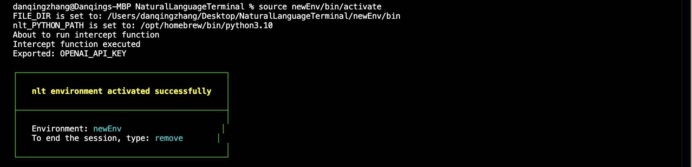
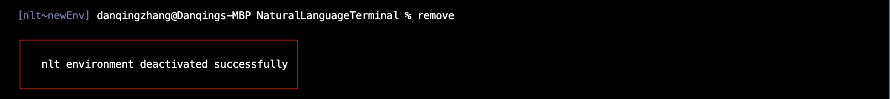
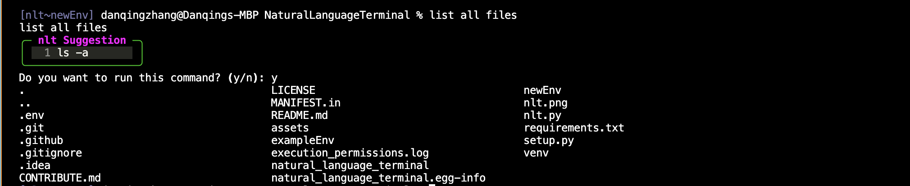

# Natural Language Terminal (NLT)
repo owner: Balaji Rama (balajirw10@gmail.com)

<p align="center">
  <strong>Welcome to the future of command-line interfaces.</strong>
</p>

<p align="center">
  Natural Language Terminal (NLT) revolutionizes the way you interact with your system, bringing the power of natural language processing to your fingertips.
</p>

<p align="center">
  <a href="#-overview">Overview</a> •
  <a href="#-features">Features</a> •
  <a href="#-installation">Installation</a> •
  <a href="#-usage">Usage</a> •
  <a href="#-plugins">Plugins</a> •
  <a href="#-contributing">Contributing</a> •
  <a href="#-license">License</a>
</p>

---

<h2>Note: We currently only support MacOS. Windows compatibility is still under development.</h2>

## 📦 1. Get Started
### 1.1 Prerequisite
Install Xcode from the Mac App Store:

Open the Mac App Store
Search for "Xcode"
Click "Get" or "Install"
The download might take a while as Xcode is a large application (several GB)


Once Xcode is fully installed, then try running the command again:
```bash
sudo xcode-select --switch /Applications/Xcode.app/Contents/Developer
```

### 1.2 Python Setup
This project is developed using Python 3.10. Follow these steps to set up your environment on Mac:
1. Install Python 3.10 using Homebrew:
```bash
brew install python@3.10
```

2. Link Python 3.10:
```bash
brew link python@3.10
```

3. Add Python aliases to your shell configuration:
```bash
echo 'alias python="/opt/homebrew/bin/python3.10"' >> ~/.zshrc
echo 'alias python3="/opt/homebrew/bin/python3.10"' >> ~/.zshrc
```

4. Apply the changes:
```bash
source ~/.zshrc
```

5. Verify your Python installation:
```bash
python --version  # Should show Python 3.10.x
python3 --version  # Should show Python 3.10.x
```
### 1.3 Installing Project Dependencies

1. Install the natural-language-terminal package from source:
```bash
python -m pip install -e .
```

2. Install required system utilities:
```bash
python -m pip install psutil
python -m pip install requests
```


## 2 Usage
### 2.1 NL session initialization
```bash
nlt init
```

### 2.2 Creating a New Environment

```bash
nlt newEnv
```
After running this command, a folder called newEnv will be created. We have uploaded the exampleEnv folder as an example for reference. See the [exampleEnv](./exampleEnv) subfolder.

### 2.3 Activating an Environment


```bash
source newEnv/bin/activate
```
<p align="center">
  
</p>

### 2.4 Deactivating 

For both macOS and Windows:

```bash
remove
```
<p align="center">
  
</p>

### 2.5 get NLT suggestions
Now you can chat with the terminal to receive command suggestions and choose whether to run them.
<p align="center">
  
</p>


## 🤝 4. Contributing

We welcome contributions! Please see our [CONTRIBUTING.md](CONTRIBUTING.md) for details on how to get started.

[](https://github.com/PathOnAI/NaturalLanguageTerminal/graphs/contributors)


---

<p align="center">
  <em>"Speak to your terminal, and it shall listen."</em>
</p>


