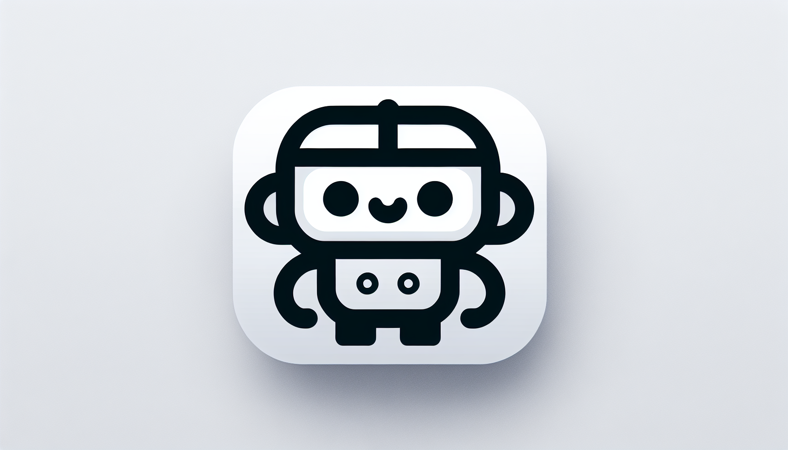

<p align="center">
  
</p>
<p align="center">
    <h1 align="center">Natural Language Shell</h1>
</p>
<p align="center">
	<!-- local repository, no metadata badges. --></p>
<p align="center">
		<em>Built with the tools and technologies:</em>
</p>
<p align="center">
	
	
	
	
</p>

<br>

<details><summary>Table of Contents</summary>

- [📍 Overview](#-overview)
- [👾 Features](#-features)
- [📂 Repository Structure](#-repository-structure)
- [🧩 Modules](#-modules)
- [🚀 Getting Started](#-getting-started)
    - [🔖 Prerequisites](#-prerequisites)
    - [📦 Installation](#-installation)
    - [🤖 Usage](#-usage)
    - [🧪 Tests](#-tests)
- [📌 Project Roadmap](#-project-roadmap)
- [🤝 Contributing](#-contributing)
- [🎗 License](#-license)
- [🙌 Acknowledgments](#-acknowledgments)

</details>

Make sure to set your OpenAI API key as an environment variable:
```
export OPENAI_API_KEY='your-api-key-here'
```
